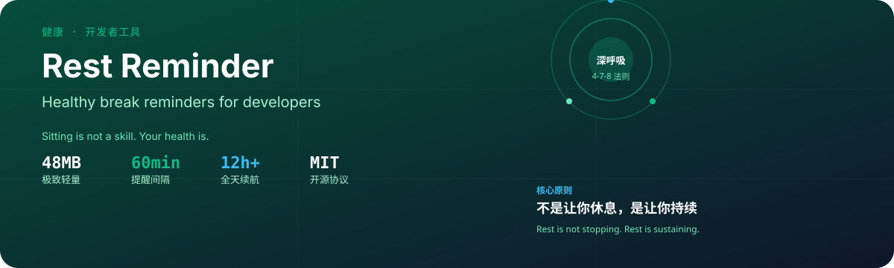

<!-- Hero SVG -->
<p align="center">
  
</p>

<h1 align="center">Rest Reminder</h1>

<p align="center">
  <strong>Healthy break reminders for developers.</strong><br/>
  <sub>Sitting is not a skill. Your health is.</sub>
</p>

---

## Why Rest Reminder?

You focus. Time disappears. Your neck, eyes, and back pay the price.

Rest Reminder is a **48MB** lightweight helper that nudges you every 60 minutes — so you can keep shipping without breaking your body.

### Core principle

> **Rest is not stopping. Rest is sustaining.**

We do not remind you to quit. We remind you to keep going — for longer, healthier, better.

---

## Four Numbers

| Metric | Value | What it means |
|--------|-------|-------------|
| **Memory** | 48MB | You will not even notice it is running |
| **Interval** | 60 min | Science-backed break frequency |
| **Battery** | 12h+ | Lasts a full workday |
| **License** | MIT | Free, open, no lock-in |

---

## How It Works

```
You focus for 60 minutes
  → Gentle notification appears
    → 4-7-8 breathing exercise (4s in, 7s hold, 8s out)
      → Return to work refreshed
        → Cycle repeats
```

---

## Features

| Feature | Detail |
|---------|--------|
| **Smart Reminder** | 60-minute configurable intervals |
| **Breathing Guide** | 4-7-8 method backed by science |
| **Non-intrusive** | Notification does not steal focus |
| **Day Tracking** | Visual summary of your break habits |
| **Multi-language** | i18n support built in |

---

## Quick Start

```bash
# Install dependencies
npm install

# Start development server
npm run dev
```

Open [http://localhost:3000](http://localhost:3000) to see it running.

---

## Stack

- **Framework:** Next.js 16 + React 19 + TypeScript 5
- **Styling:** Tailwind CSS 4
- **Motion:** framer-motion 12

---

## Links

- **GitHub:** [rest-reminder-site](https://github.com/kuangketongxue/rest-reminder-site)
- **MIT Licensed](./LICENSE)

---

<p align="center">
  <sub>Rest is not stopping. Rest is sustaining.</sub>
</p>
